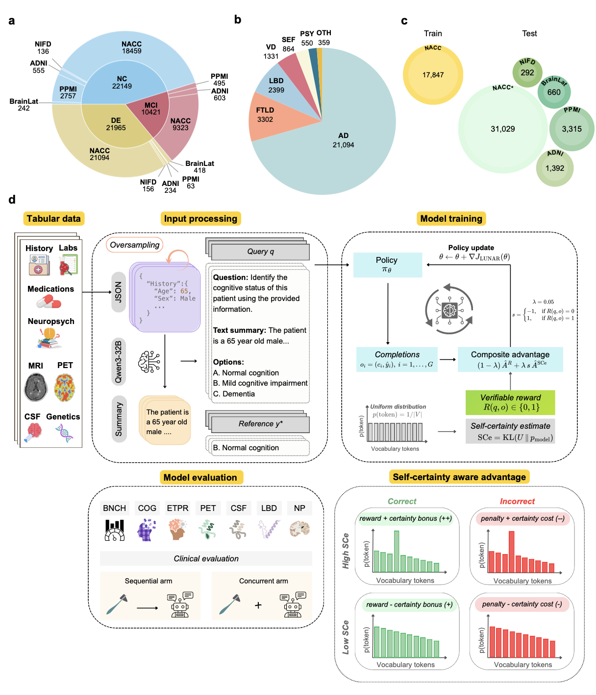

# LUNAR: Domain-Adapted Language Model for Various Dementias

<p align="center">
  <a href="https://www.medrxiv.org/content/10.64898/2026.03.17.26348154v1"></a>
  <a href="https://github.com/vkola-lab/lunar/blob/main/LICENSE"></a>
  
  <!--  -->
</p>

## Overview

**LUNAR** (**L**anguage model for **U**nified **N**eurological **A**ssessment and **R**easoning) is a domain-adapted generative language model for Alzheimer's disease and related dementias (ADRD). It is fine-tuned via reinforcement learning with verifiable rewards (RLVR) using a self-certainty-aware advantage, enabling clinically grounded chain-of-thought reasoning without requiring expensive annotated reasoning data.

Model development and validation leveraged data from five ADRD cohorts totaling 54,535 participants (NACC, ADNI, BrainLat, NIFD, PPMI). The framework integrates demographics, personal and family medical histories, medication use, neuropsychological test results, functional assessments, physical and neurological examination findings, laboratory data, and multimodal neuroimaging to construct comprehensive clinical profiles. On held-out testing data involving 36,688 participants, LUNAR achieved robust performance on syndromic classification, primary etiological diagnosis, and biomarker prediction. Model predictions were validated against postmortem-confirmed diagnoses, and clinical utility was demonstrated in a controlled within-subjects crossover study where board-certified neurologists reviewed cases with and without model assistance, showing that exposure to model responses improved diagnostic performance.

<p align="center">
  
</p>


## Repository Structure

```
lunar/
├── adrd_simplified_evaluation/   # Evaluation scripts benchmarking LUNAR on ADRD tasks
├── data_preparation/             # Data preprocessing and harmonization pipelines
├── open-r1/                      # RLVR training code built on the open-r1 framework
├── LICENSE
└── README.md
```

See the README in each subdirectory for detailed instructions:
- [`adrd_simplified_evaluation/README.md`](adrd_simplified_evaluation/README.md)
- [`data_preparation/README.md`](data_preparation/README.md)
- [`open-r1/README.md`](open-r1/README.md)

## Prerequisites

### Hardware
- Training: 4× NVIDIA H200 GPUs (~9 hours for 1,491 steps / 1 epoch)
- Inference: single NVIDIA L40S GPU (< 1 minute per case)

### Software

**Training environment**

```
Python        3.11.13
CUDA          12.8
torch         2.6.0
transformers  4.52.4
trl           0.19.0
deepspeed     0.16.8
vllm          0.8.5.post1
peft
```

**Evaluation & data analysis environment**

```
Python        3.12.4
torch         2.4.0
vllm          0.12.0
pandas        2.2.2
numpy         1.26.3
scikit-learn  1.5.1
scipy         1.14.0
```

## Installation

```bash
git clone https://github.com/vkola-lab/lunar.git
cd lunar
```

<!-- Create a conda environment and install dependencies: -->

<!-- ```bash
conda create -n lunar python=3.10 -y
conda activate lunar

# PyTorch (adjust CUDA version as needed)
pip install torch==2.6.0 --index-url https://download.pytorch.org/whl/cu121

# Training
pip install transformers==4.52.4 trl==0.19.0 deepspeed==0.16.8 peft
pip install vllm==0.8.5.post1

# Data & evaluation
pip install pandas numpy scikit-learn scipy statsmodels
``` -->

See each submodule's README for creating environments and installing dependencies.

## Data Access

LUNAR was trained and evaluated on five cohorts. Access must be requested directly from each source:

| Cohort | Description | Access |
|--------|-------------|--------|
| NACC | National Alzheimer's Coordinating Center | [naccdata.org](https://naccdata.org) |
| ADNI | Alzheimer's Disease Neuroimaging Initiative | [ida.loni.usc.edu](https://ida.loni.usc.edu) |
| NIFD | Frontotemporal Lobar Degeneration Neuroimaging Initiative | [ida.loni.usc.edu](https://ida.loni.usc.edu) |
| PPMI | Parkinson's Progression Markers Initiative | [ppmi-info.org](https://www.ppmi-info.org/access-data-specimens/download-data) |
| BrainLat | Latin American neurodegeneration cohort | [doi.org/10.1038/s41597-023-02806-8](https://doi.org/10.1038/s41597-023-02806-8) |

## Usage

### 1. Data Preparation

Preprocess raw cohort data into harmonized JSON files and clinical prose narratives. See [`data_preparation/README.md`](data_preparation/README.md) for full details.

### 2. Training (RLVR)

Fine-tune LUNAR on top of Qwen2.5-3B-Instruct using the open-r1 RLVR pipeline. See [`open-r1/README.md`](open-r1/README.md) for configuration and training instructions.

### 3. Evaluation

Evaluate LUNAR on all ADRD tasks and plot the results. See [`adrd_simplified_evaluation/README.md`](adrd_simplified_evaluation/README.md) for details.

## Method Summary

LUNAR fine-tunes **Qwen2.5-3B-Instruct** using **Dr.GRPO** (Done Right Group Relative Policy Optimization) with two key additions:

- **Self-certainty-aware advantage**: augments the standard reward-based advantage with a KL-divergence-based confidence signal, rewarding high confidence when correct and penalizing it when incorrect — producing more calibrated, concise outputs.
- **Task-specific oversampling**: minority etiologies (LBD, VD, PSY, SEF, OTH) are upsampled to prevent model collapse toward majority-class predictions.

Multimodal clinical data (demographics, labs, medications, neuropsychological tests, MRI/PET, CSF, genetics) is converted to structured JSON and summarized into clinical prose using Qwen3-32B. These narratives are used as inputs for six closed-ended multiple-choice diagnostic task types: cognitive status (COG), primary etiology (ETPR), amyloid PET (PET), amyloid CSF (CSF), DaT imaging (DAT), and neuropathology (NP-ONE).
<!-- 
## Citation

```bibtex
@article{kowshik2026lunar,
  title   = {Domain-adapted language model using reinforcement learning for various dementias},
  author  = {Kowshik, Sahana S. and Jasodanand, Varuna H. and Bellitti, Matteo and
             Puducheri, Shreyas and Xu, Lingyi and Liu, Yi and Saichandran, Ketan S. and
             Dwyer, Brigid C. and Gabelle, Audrey and Hao, Honglin and Kedar, Sachin and
             Murman, Daniel L. and O'Shea, Sarah A. and Saint-Hilaire, Marie-Helene and
             Samudra, Niyatee P. and Sartor, Emmett A. and Swaminathan, Arun and
             Taraschenko, Olga and Yuan, Jing and Au, Rhoda and Kolachalama, Vijaya B.},
  journal = {medRxiv},
  year    = {2026},
  doi     = {10.64898/2026.03.17.26348154}
}
``` -->

## License

This project is licensed under the [GNU Affero General Public License v3.0](LICENSE).

<!-- ## Contact

For questions, open an issue or contact the corresponding author at vkola@bu.edu. -->